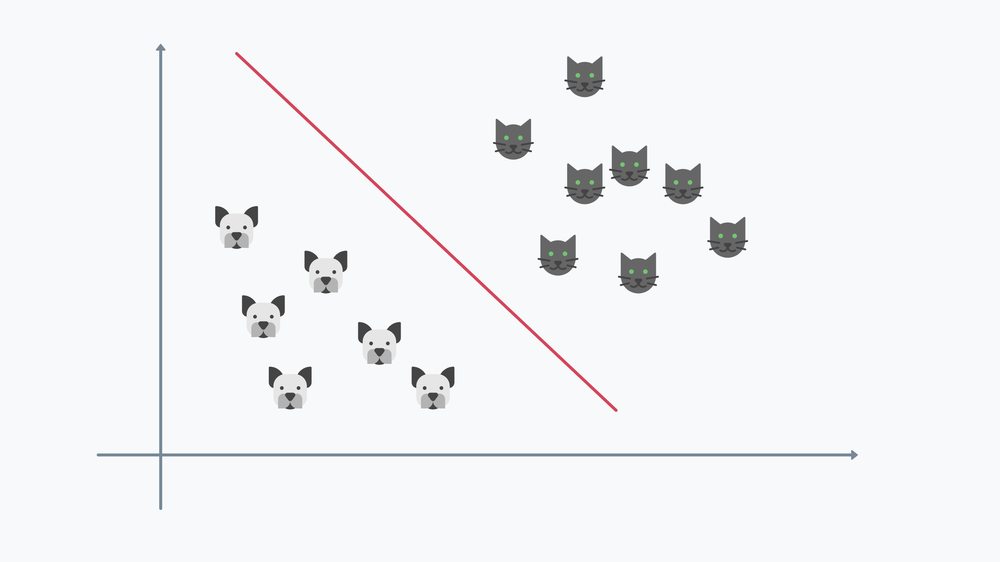

# Perceptron - 感知器

## What is Perceptron?
* Perceptron (感知器) 可以說是最簡單的神經元結構，它是一個簡單的二元分類器，可以用來做線性分類。
* 前面有提過 Nearual 神經元的結構可以視為三個大結構，分別是 Input Layer、Hidden Layer、Output Layer，而 Perceptron 就是一個單純的神經元，只有 Input Layer 和 Output Layer，沒有 Hidden Layer。
* Perceptron 接收了兩個訊號，分別是 $x_1$ 跟 $x_2$，並經過其對應的權重 $w_1$, $w_2$ 和配合的偏差 $b$，並在超過其閥值 $t$ 時，輸出 1，否則輸出 0。
  * Perceptron 的公式可以表示為：
    * $y = \begin{cases} 1 & \text{if } w_1x_1 + w_2x_2 + b > t \\ 0 & \text{otherwise} \end{cases}$
* 我們用一個例子來說明 Perceptron 可以做到什麼，假如我今天希望藉由一些特徵辨識貓貓狗狗，而且他們的分布狀況如下圖，那我們可以發現，貓貓的特徵是在右上角，而狗狗的特徵是在左下角，而我們可以用一條直線將兩者分開，這就是 Perceptron 所能做到的事情。
  * 
* 這邊我們用一個簡單的例子來說明 Perceptron 的運作方式，假如我今天有一個簡單的神經元，它的輸入有兩個，分別是 $x_1$ 跟 $x_2$，而它的輸出有一個，分別是 $y$，而我們可以用一個簡單的表格來表示這個神經元的運作方式，如下表所示：
  > | $x_1$ | $x_2$ |  $y$  |
  > | :---: | :---: | :---: |
  > |   0   |   0   |   0   |
  > |   0   |   1   |   0   |
  > |   1   |   0   |   0   |
  > |   1   |   1   |   1   |
  * 我們可以發現，當 $x_1$ 跟 $x_2$ 都為 1 時，$y$ 才會為 1，而其他情況都是 0，這就是我們所說的 Perceptron，它是一個簡單的二元分類器，可以用來做線性分類。
* 但 Perceptron 也有一個很大的缺點，也就是他只能做線性分類，而這個缺點甚至差點摧毀了 Deep Learning 的發展，原因是對於 Conputer Coculation 而言，線性分類是非常容易的，因為 AND, OR Gate 本身就在做這個任務了，但 XOR Gate 能做到的互斥結果，Perceptron 卻做不到，因為 XOR 的分類線是一條曲線，而 Perceptron 只能做線性分類，所以這個缺點差點摧毀了 Deep Learning 的發展，因為 Deep Learning 竟然不如原本的 Conputer Coculation。
  > | $x_1$ | $x_2$ |  $y$  |
  > | :---: | :---: | :---: |
  > |   0   |   0   |   0  |
  > |   0   |   1   |   1  |
  > |   1   |   0   |   1  |
  > |   1   |   1   |   0  |
* 在 `perceptron.py` 中，我們簡單的利用 `numpy` 來實作 Perceptron，並且實作出 AND, OR, NAND Gate 還有一個 Multi-Input 的 Cat, Dog 分類器 Example。

## How to Solve XOR Problem

* 那 Perceptron 真的就沒辦法解決 XOR 問題嗎？答案是沒有，但我們可以利用多層的 Perceptron 來解決 XOR 問題，而這個多層的 Perceptron 更貼近我們所說的 Neural Network 的結構。
* 我們人體的辨識應該也不會只靠一個神經元就完成所有的辨識，而會是一堆神經元組成的神經網絡，因此如果今天一個 Perceptron 無法解決非線性分類問題，我們是不是可以利用多個 Perceptron 來解決這個問題呢？
* 我們一樣回歸到 Computer Coculation 的角度，我們今天有沒有辦法利用 AND, OR, NAND Gate 來實現一個 XOR Gate 呢？答案是有的，我們可以利用下面的圖來實現 XOR Gate，如下圖所示：
  * 
